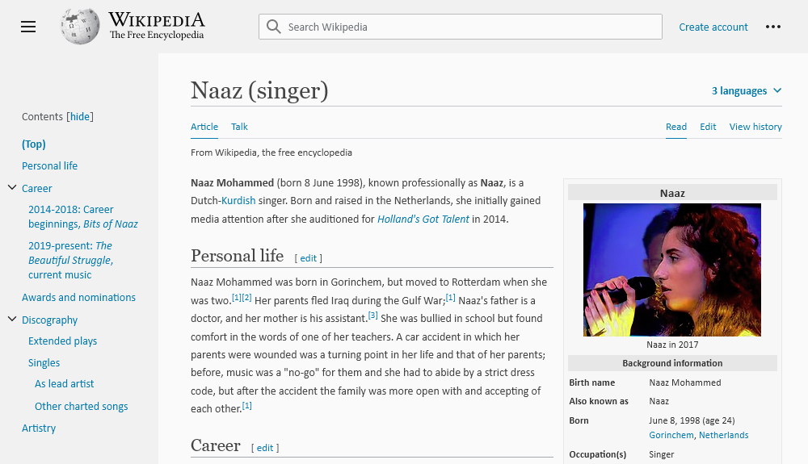

# WikiMuch
by ltGuillaume: [Codeberg](https://codeberg.org/ltguillaume) | [GitHub](https://github.com/ltGuillaume) | [Buy me a beer](https://buymeacoff.ee/ltGuillaume) 🍺

CSS and JavaScript interface changes to clean up Wikipedia. Press F8 for dark mode. Remade for the recent Wikipedia Vector 2022 facelift.

## Getting started
1. Install a userscript manager in your browser (this script has been tested with [ViolentMonkey](https://violentmonkey.github.io/get-it/))
1. Open [wikimuch.user.js](wikimuch.user.js?raw=1) and confirm installation

## Remarks
- v3 has been made from scratch and does not include language rearrangement, because Wikipedia has implemented a decent solution for this already.
- The old WikiMuch v2 still supports the [main instance](https://wikiless.org) of [Wikiless](https://codeberg.org/orenom/wikiless), a privacy-friendly Wikipedia front-end without JavaScript. Therefore, it has been renamed to [wikiless.user.js](wikiless.user.js?raw=1).

## Credits
* [Logo](https://www.iconfinder.com/icons/456114) by [Bartlomiej Jacak](https://www.iconfinder.com/bartekjacak)
* v2 was based on work by [Lyutria](https://userstyles.org/users/266181), who created a nice little mish-mash of the Wikipedia Minimal and the Paper (Sidebar) styles, as you can [find here](https://userstyles.org/styles/102164). I tweaked a lot of stuff and added language selection via [Paul's](https://greasyfork.org/en/users/10155-paul-the-anonymous) [Wikipedia rearrange other languages](https://greasyfork.org/en/scripts/10731).